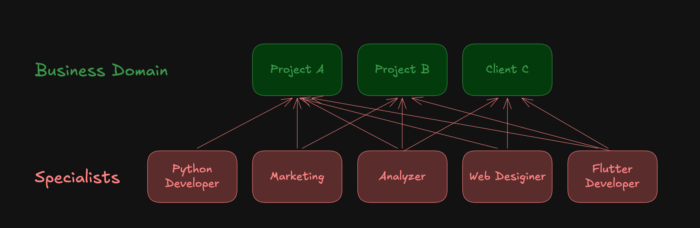
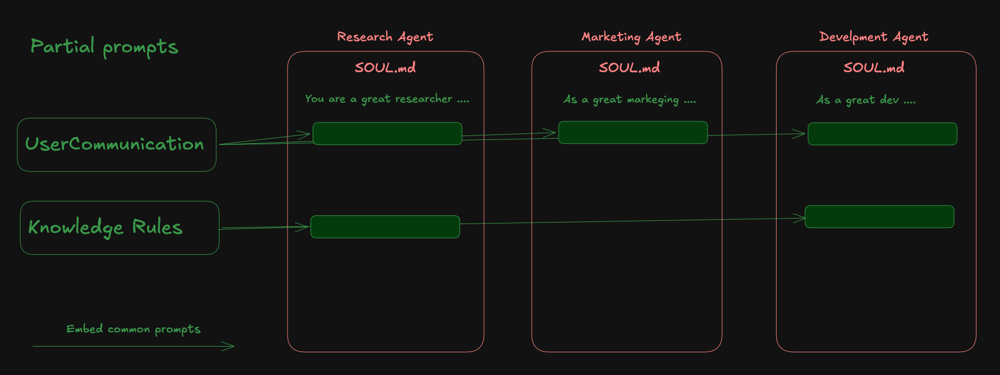

# Hermes Manager

    [-blue?style=flat-square>)](./README.pt-BR.md)     

Hermes Manager é um control plane em Next.js para operar de forma centralizada muitos Hermes Agents em um único host.
Ao contrário do dashboard oficial do Hermes, que é uma UI para gerenciar uma única instalação do Hermes, o Hermes Manager não é um substituto com paridade de recursos. Ele é posicionado para operações multiagente em redes confiáveis / ambientes de intranet. Seu foco está em provisionamento de agents, aplicação de templates/partials, camadas de variáveis de ambiente por agent, controle de serviços locais e gestão transversal de configurações, logs e histórico de chat.

A operação com “partial prompts”, que permite manter o SOUL de vários agents com componentes compartilhados, também é um diferencial central deste aplicativo. Cada agent mantém um `SOUL.md` já expandido e compatível com o runtime, enquanto pode incorporar partials compartilhados a partir de um `SOUL.src.md` editável usando `embed/include`. Isso permite atualizar em um único lugar políticas comuns e regras operacionais aplicadas a vários agents, preservando separadamente apenas as diferenças específicas de cada agent.

## Recursos deste aplicativo

- control plane para operar de forma centralizada vários agents em um único host
- base de operação de subagents com managed delegation / dispatch entre agents
- controle de destinos de delegação, prevenção de ciclos e limite máximo de hops por meio de políticas de delegação por agent
- possibilidade de o operador montar livremente modelos de divisão de papéis, como domain agents e specialist agents
- provisionamento reutilizável com templates / partials / memory assets
- composabilidade de SOUL que permite embutir partial prompts compartilhados no `SOUL.md` de vários agents
- regeneração automática do `SOUL.md` montado, mantendo compatibilidade com o runtime Hermes
- modelo operacional que separa a manutenção das diferenças por agent das regras comuns de toda a fleet
- controle de serviços locais integrado com launchd / systemd

### Managed Subagent Delegation

O recurso de subagents do Hermes Manager permite criar um modelo operacional em que os agents não funcionam isoladamente, mas cooperam divididos por papéis. No diagrama, agents organizados por domínio de negócio, como Project A / Project B / Client C, servem como ponto de entrada para solicitações dos usuários e delegam o trabalho necessário a specialist agents como Python Developer, Marketing Analyzer, Web Designer e Flutter Developer.

Nesse modelo, o Hermes Manager não apenas fornece um ponto de entrada para comunicação entre agents; ele atua como um control plane que permite ao operador gerenciar quais specialist agents cada agent pode usar e até quantos níveis a delegação pode avançar. Assim, mesmo aumentando o número de agents responsáveis por domínios de negócio, é possível reutilizar capacidades especializadas como recursos compartilhados e manter um comportamento consistente em toda a fleet.

O valor dessa funcionalidade está em permitir operar com segurança a divisão de papéis desenhada pelo operador por meio de managed delegation e controle por políticas. Mesmo que o número de agents de atendimento aumente, specialist agents continuam fáceis de reutilizar, e as regras de delegação podem ser administradas de forma centralizada, facilitando a manutenção contínua de fluxos de trabalho reais compostos por vários agents.

### Shared Partial Prompt / SOUL Composability

Nessa estrutura, partial prompts compartilhados são gerenciados como assets comuns e incluídos via `embed/include` a partir do `SOUL.src.md` de vários agents para montar o `SOUL.md` final. O operador pode concentrar no lado dos partials as regras, políticas de segurança e convenções operacionais do host comuns a todos os agents, enquanto escreve em cada agent apenas as diferenças específicas do seu papel. Como resultado, reduz-se o risco de dessincronização das instruções comuns e a manutenção do SOUL de toda a fleet pode ser feita de forma consistente.

## Mapa da documentação

- Definição de requisitos: [`docs/requirements.md`](./docs/requirements.md)
- Arquitetura / design de API: [`docs/design.md`](./docs/design.md)
- README em inglês: [`README.md`](./README.md)
- Guia de contribuição: [`CONTRIBUTING.md`](./CONTRIBUTING.md)
- Relato de segurança: [`SECURITY.md`](./SECURITY.md)
- Informações de suporte para usuários: [`SUPPORT.md`](./SUPPORT.md)

## Visão geral

No Hermes Manager, as seguintes operações podem ser realizadas pela UI do navegador:

- operação centralizada de vários agents em um único host
- provisionamento, duplicação e remoção de agents
- iniciar, parar e reiniciar via launchd (macOS) / systemd (Linux)
- edição de `SOUL.md`, `SOUL.src.md`, `memories/MEMORY.md`, `memories/USER.md`, `config.yaml` e `.env`
- gerenciamento em camadas de variáveis de ambiente globais / por agent com metadados de visibilidade
- reutilização de templates / partials e equipar skills a partir de um catálogo local de skills
- verificação de controle de serviços locais, logs, jobs de Cron e sessões de chat

## Segurança / limite de confiança

Este projeto pressupõe operação em redes confiáveis / intranets.
Ele não inclui por padrão autenticação voltada para a internet pública, separação de permissões para muitos usuários nem proteções para exposição externa.
Se for operá-lo fora da intranet, adicione obrigatoriamente sua própria autenticação e controle de acesso na camada anterior.

## Capturas de tela

### Lista de Agents

### Gerenciamento de memória

## Como contribuir

Consulte [`CONTRIBUTING.md`](./CONTRIBUTING.md) para o fluxo de propostas, gates de qualidade e pré-requisitos de implementação.

## Licença

MIT. Consulte [`LICENSE`](./LICENSE).
