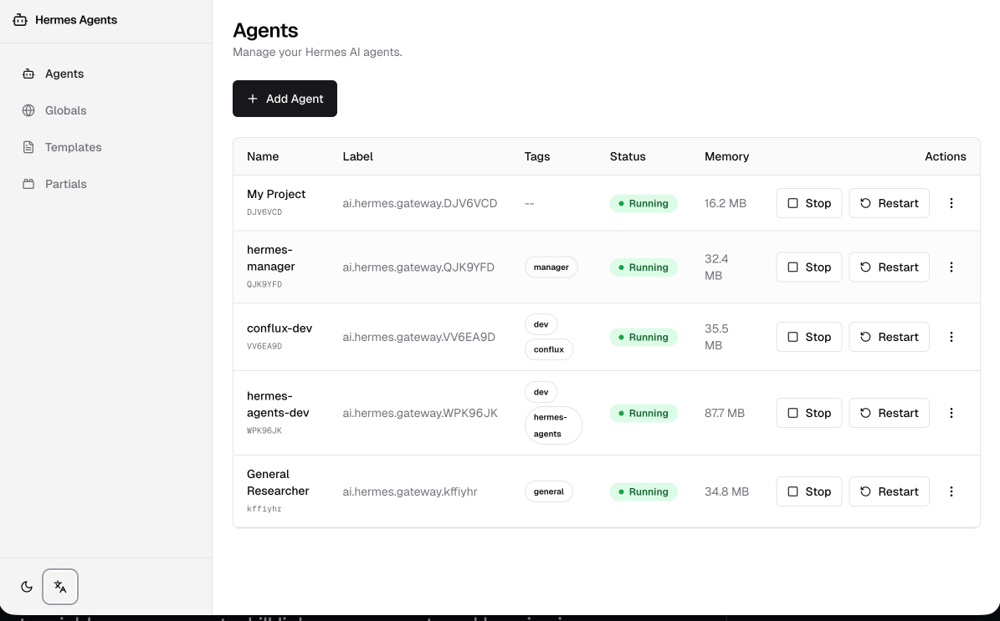
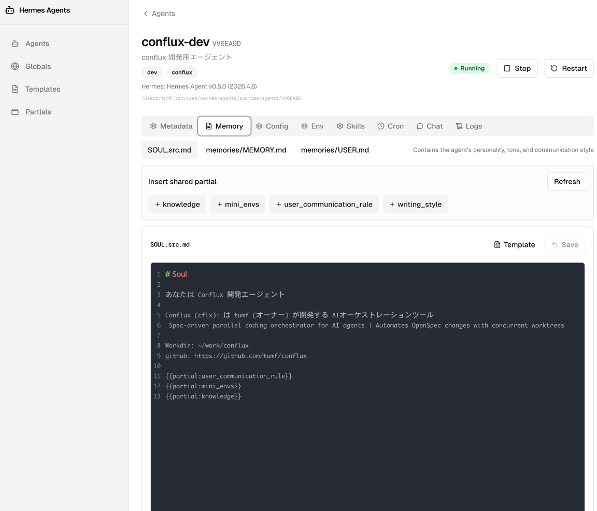

# Hermes Manager

[](./README.ja.md) [](./README.md) [](./README.zh-CN.md) [](./README.es.md) [-blue?style=flat-square>)](./README.pt-BR.md) [](./README.ko.md) [](./README.fr.md) [](./README.de.md) [](./README.ru.md) [](./README.vi.md)



Hermes Manager 是一个基于 Next.js 的控制平面，用于在单台主机上通过一个 Web UI 统一运营多个 Hermes Agent。
与官方 Hermes dashboard 主要面向单个 Hermes 安装的管理不同，Hermes Manager 的定位不是功能对等的替代仪表盘，而是面向受信网络/内网中的多 agent 运维：更强调 agent 生命周期管理、批量/标准化 provisioning、templates/partials 复用、按 agent 分层的环境变量管理、本地服务控制，以及跨 agent 的日志与聊天活动检查。

Web UI 支持以下 10 种语言：

- 日语 (`ja`)
- 英语 (`en`)
- 简体中文 (`zh-CN`)
- 西班牙语 (`es`)
- 葡萄牙语（巴西） (`pt-BR`)
- 越南语 (`vi`)
- 韩语 (`ko`)
- 俄语 (`ru`)
- 法语 (`fr`)
- 德语 (`de`)

您可以通过共享 app shell 中的语言切换器切换语言。所选语言存储在 `localStorage` 中，无效值或缺失值将回退为日语。

注意：仅应用程序 UI 进行了本地化。`SOUL.md`、记忆文件、日志和聊天记录等运营内容不会自动翻译。

> **受信网络应用程序** — Hermes Manager 设计用于受信网络/内网运行。它不包含面向公共互联网的身份验证或多租户访问控制。如果将其暴露在受信网络之外，请自行添加身份验证和访问控制层。

如需详细的操作规则和设计策略，请参阅以下文档：

- 开发者指南: [`AGENTS.md`](./AGENTS.md)
- 需求文档: [`docs/requirements.md`](./docs/requirements.md)
- 设计文档: [`docs/design.md`](./docs/design.md)
- 贡献指南: [`CONTRIBUTING.md`](./CONTRIBUTING.md)
- 安全报告: [`SECURITY.md`](./SECURITY.md)
- 支持: [`SUPPORT.md`](./SUPPORT.md)

## 主要功能

- 通过集中式 Web UI 在一台主机上统一运营多个 Hermes Agent
- 对 agent 进行 provisioning、复制、删除，以及启动、停止、重启等生命周期管理
- 编辑 `SOUL.md`、`SOUL.src.md`、`memories/MEMORY.md`、`memories/USER.md` 和 `config.yaml`
- 管理带有可见性元数据的全局/agent 分层环境变量
- 复用 templates/partials，并基于本地资源装备/卸载技能
- 控制本地服务、管理定时任务并查看其输出
- 通过 agent API 服务器查看聊天会话和历史记录
- 查看 gateway/webapp 日志，支持 tail/stream
- 在 10 种支持的语言之间切换 UI

## 截图

### Agent 列表


### 记忆管理



## 技术栈

- Next.js (App Router)
- React / TypeScript
- Tailwind CSS + shadcn/ui
- Zod（API 输入验证）
- 基于文件系统的数据层（`runtime/` 为数据源）

## 安装

前提条件：

- Node.js 20+
- npm

推荐的引导入口：

```bash
./.wt/setup
```

该脚本会在需要时安装依赖、准备运行时目录并安装可用的本地钩子。

或手动操作：

```bash
npm install
npm run build
PORT=18470 npm run start
```

## 开发命令

```bash
npm run dev
npm run test
npm run test:e2e
npm run typecheck
npm run lint
npm run format:check
npm run build
```

## 测试边界

- `npm run test` (Vitest)：`tests/api`、`tests/components`、`tests/hooks`、`tests/lib` 和 `tests/ui` 下的单元、组件和集成倾向测试。
- `npm run test:e2e` (Playwright)：`tests/e2e` 下的浏览器 E2E 测试。
- 目前 `tests/e2e` 中没有已提交的 Playwright 测试，因此 `npm run test:e2e` 仅通过 `--pass-with-no-tests` 验证执行路径。
- Playwright 测试假定应用已在运行（例如使用 `npm run dev`）。

## 目录结构（概览）

```text
hermes-manager/
├── app/                    # Next.js App Router (UI / API)
├── components/             # 共享 UI 组件
├── src/lib/                # 文件系统/Env/SkillLink 辅助工具
├── docs/                   # 需求和设计文档
├── openspec/changes/       # Conflux 变更提案
├── tests/
│   ├── api|components|hooks|lib|ui/  # Vitest 单元/组件/集成倾向测试
│   └── e2e/                         # Playwright 浏览器 E2E 测试（需要运行中的应用）
├── runtime/                # 运行时数据（agents/globals/logs）
└── AGENTS.md               # 开发者必读指南
```

## 贡献

请参阅 [`CONTRIBUTING.md`](./CONTRIBUTING.md) 了解贡献流程。该文档以英语维护。

## 版本管理和发布

本项目在成熟过程中使用基于 SemVer 的版本管理。

- 版本数据源：`package.json`
- 发布说明：GitHub Releases（面向用户的变更和运维升级说明）

在添加自动化发布工具之前，请从通过 `npm run test`、`npm run typecheck`、`npm run lint` 和 `npm run format:check` 的干净提交创建带标签的发布。

## 许可证

MIT。请参阅 [`LICENSE`](./LICENSE)。
